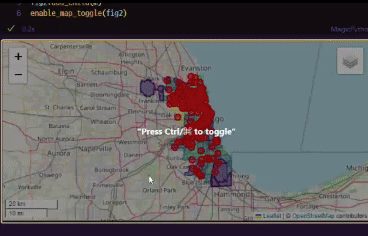

# FoliumLocker

**`Now in progress`**

A simple funtcion for Folium(branca) and Jupyter Notebook to add a locker button to lock/unlock map interactions.


## Description

FoliumLocker is a simple yet effective fewature for Folium that adds a toggle locker button to your interactive maps. This feature allows users to lock or unlock map interactions, preventing unwanted zooming or panning when scrolling through a webpage.


## Features

- **enable_map_toggle**: With branca Figure, add simple script to enable map toggle locker button(*ctrl* to toggle unlock/lock map interactions)

## Usage

Just import the function and call it with your Folium map object with branca Figure.

```python
import folium
from branca.element import Figure
from maptoggle import enable_map_toggle 

m = folium.Map(location=[37.5, 127])
fig = Figure()
fig.add_child(m)
enable_map_toggle(fig)
```